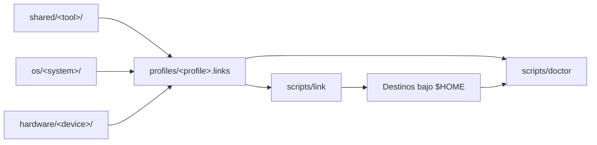

# Dotfiles Architecture

Este documento describe la arquitectura objetivo del repositorio. La meta es
mantener una unica fuente de verdad reproducible para macOS, GNU/Linux y
Windows sin duplicar configuraciones compartidas.

## Principles

- Un solo repositorio central para los dotfiles personales.
- Una configuracion tiene una unica ubicacion canonica.
- Las configuraciones compartidas se separan de las exclusivas de un sistema.
- Las diferencias de una maquina no se confunden con las del sistema operativo.
- Los perfiles declaran que piezas se despliegan juntas.
- El repositorio guarda fuentes; el sistema usa symlinks y rutas estandar.
- Secretos, caches, builds y estado generado quedan fuera de Git.
- Los cambios estructurales se realizan de forma incremental y verificable.

## Naming Convention

Los nombres de carpetas, archivos tecnicos y titulos se escriben en ingles. El
contenido explicativo se escribe en espanol.

Ejemplos:

```text
docs/ARCHITECTURE.md
docs/adr/0005-group-shared-configurations.md
os/linux/dwm/
profiles/macos-main.links
```

## Canonical Structure

```text
mydotfiles/
  shared/                    # herramientas y configuraciones compartidas
    kitty/
    nvim/
    starship/
    tmux/
    yazi/
    zsh/

  os/                        # configuraciones exclusivas por sistema
    macos/
      aerospace/
      borders/
      hammerspoon/
      sketchybar/
      packages/
        homebrew/
    linux/
      dwm/
      i3/
      x11/
      wayland/
      packages/
    windows/
      powershell/
      windows-terminal/
      packages/

  profiles/                  # manifiestos instalables
    macos-main.links
    arch-dwm.links
    windows-native.links

  hardware/                  # firmware y configuracion de perifericos
    silakka54/

  scripts/                   # automatizacion transversal del repositorio
    link
    doctor
    bootstrap

  .githooks/                 # hooks de Git versionados
    pre-commit

  docs/
    ARCHITECTURE.md
    RESTORE.md
    adr/
    inventory/
    machines/
```

Esta estructura ya esta activa. Las nuevas herramientas deben clasificarse antes
de agregarse; no se crean carpetas de herramientas directamente en la raiz.

## Deployment Flow



El perfil relaciona cada fuente versionada con su destino. `scripts/link` crea o
repara los symlinks y `scripts/doctor` comprueba que el sistema siga apuntando a
las fuentes correctas.

## Shared Configurations

`shared/<tool>/` contiene herramientas que se reutilizan en mas de un sistema o
que tienen una base razonablemente portable.

Ejemplos:

- Kitty y Ghostty entre macOS y GNU/Linux;
- Neovim, Git, Starship, Tmux, Lazygit, Yazi, Btop, Fzf y Ripgrep;
- VS Code cuando la configuracion comun evita rutas absolutas del sistema;
- Zsh entre macOS y GNU/Linux.

Una pequena diferencia de plataforma no justifica duplicar una configuracion
completa. Se prefieren includes, variables de entorno o archivos locales
ignorados. Si la implementacion entera pertenece a un solo sistema, vive en
`os/<system>/`.

## Operating System Layers

`os/<system>/` contiene configuraciones, scripts, servicios y administracion de
paquetes que solo tienen sentido en ese sistema.

### macOS

- AeroSpace;
- Sketchybar;
- Hammerspoon;
- JankyBorders;
- Homebrew y servicios de macOS.

### GNU/Linux

- DWM, i3 y otros window managers;
- X11 y Wayland;
- systemd user services;
- Pacman, Makepkg y helpers de AUR.

DWM comienza directamente en `os/linux/dwm/`; no se crea una carpeta DWM en la
raiz ni dentro de la documentacion de una maquina.

### Windows

- PowerShell cuando la configuracion sea exclusivamente nativa;
- Windows Terminal;
- Winget y ajustes propios de Windows.

## Machine-Specific State

No existe una capa `hosts/` en la estructura actual porque todavia no hay
configuraciones versionadas que justifiquen una jerarquia completa por maquina.

Las responsabilidades se distribuyen asi:

- configuracion reutilizable: `shared/` u `os/<system>/`;
- seleccion de piezas para una maquina: `profiles/<profile>.links`;
- inventario, migracion y recuperacion: `docs/machines/<machine>.md`;
- rutas privadas, secretos y valores puramente locales: archivos ignorados.

Si aparecen diferencias versionables que no puedan expresarse con estas capas,
se documentara el caso real antes de agregar una categoria nueva.

## Profiles

Los perfiles declaran que fuentes se enlazan para formar un entorno. No
contienen configuraciones.

Cada entrada de `profiles/*.links` relaciona una fuente relativa al repositorio
con un destino bajo `$HOME`. Por ejemplo:

```text
shared/nvim|$HOME/.config/nvim
os/macos/aerospace|$HOME/.config/aerospace
```

Herramientas activas:

```sh
scripts/doctor macos-main
scripts/link --dry-run macos-main
scripts/link --repair macos-main
```

El linker nunca reemplaza automaticamente un archivo o directorio real.

## Packages And Inventories

La instalacion de paquetes vive bajo el sistema que la administra:

```text
os/macos/packages/homebrew/
os/linux/packages/
os/windows/packages/
```

Las listas informativas que no son instalables viven en `docs/inventory/`. No
se mezclan inventarios deseados, configuraciones activas y manifiestos de
paquetes reproducibles.

## Paths And Local Data

Preferir:

```sh
$HOME/.config/nvim
$XDG_CONFIG_HOME
$HOME/mydotfiles
```

Evitar en configuraciones compartidas:

```sh
/Users/jd/.config/nvim
/home/otro-usuario/.config/nvim
```

Rutas personales variables se exponen mediante variables de entorno o archivos
locales ignorados. Secretos, tokens, claves privadas y credenciales quedan fuera
de Git.

En GNU/Linux se respetan las rutas XDG:

- configuracion: `$XDG_CONFIG_HOME` o `$HOME/.config`;
- ejecutables personales: `$HOME/.local/bin`;
- datos: `$XDG_DATA_HOME` o `$HOME/.local/share`;
- estado: `$XDG_STATE_HOME` o `$HOME/.local/state`;
- cache: `$XDG_CACHE_HOME` o `$HOME/.cache`.

## Linking Strategy

Los symlinks siguen siendo la estrategia activa. Los destinos no dependen de la
ubicacion interna antigua porque `profiles/*.links` funciona como manifiesto y
`scripts/link` puede crearlos o repararlos.

Stow o Chezmoi se evaluaran cuando macOS, Arch y Windows aporten diferencias
reales que el linker simple no pueda manejar limpiamente. Adoptarlos en el
futuro no requiere volver a decidir la clasificacion del repositorio.

## Continuous Verification

`.github/workflows/lint.yml` protege dos contratos en cada push y pull request:

1. `scripts/lint-shell` ejecuta ShellCheck sobre los scripts operativos;
2. el perfil `macos-main` se aplica dentro de un `$HOME` temporal y luego se
   valida con `scripts/doctor`.

Las paletas de `shared/colorscheme/list/` se cargan como datos y no se ejecutan
como programas independientes; por eso no forman parte del lint operativo.

## Migration Sequence

1. Inventariar y verificar los enlaces actuales mediante un perfil.
2. Mover las configuraciones exclusivas de macOS a `os/macos/`.
3. Reparar los enlaces y validar las aplicaciones afectadas.
4. Mantener las configuraciones compartidas bajo `shared/` y verificar sus
   perfiles.
5. Mover firmware y perifericos a `hardware/`.
6. Convertir inventarios de software en documentacion o manifiestos reales.
7. Crear `os/linux/dwm/` y el perfil `arch-dwm` sin depender de archivos
   manuales de la maquina remota.
8. Incorporar Windows cuando exista un entorno real para probarlo.

Cada etapa debe dejar `scripts/doctor <profile>` sin errores y un rollback claro.

## ADR Policy

Los ADR viven en `docs/adr/`. Se agrega uno cuando una decision cambia la
estructura, la restauracion o las convenciones compartidas del repositorio. No
se agrega un ADR para temas, aliases o ajustes internos de una sola herramienta.
