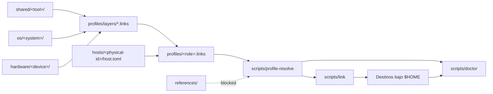

# Dotfiles Architecture

Este documento describe la arquitectura objetivo del repositorio. La meta es
mantener una unica fuente de verdad reproducible para macOS, GNU/Linux y
Windows sin duplicar configuraciones compartidas. Una futura configuracion
declarativa completa de NixOS queda fuera de este alcance y tendra su propio
repositorio si llega a adoptarse.

## Principles

- Un solo repositorio central para los dotfiles personales.
- Una configuracion tiene una unica ubicacion canonica.
- Las configuraciones compartidas se separan de las exclusivas de un sistema.
- Las diferencias de una maquina no se confunden con las del sistema operativo.
- Los perfiles describen roles reusables; los hosts describen maquinas fisicas.
- X11, Wayland y cada sesion grafica conservan limites explicitos.
- Produccion nunca recibe implicitamente cambios validados solo en el canary.
- El repositorio guarda fuentes; el sistema usa symlinks y rutas estandar.
- Secretos, caches, builds y estado generado quedan fuera de Git.
- El material externo de referencia queda separado del runtime desplegable.
- Los cambios estructurales se realizan de forma incremental y verificable.

## Naming Convention

Los nombres de carpetas, archivos tecnicos y titulos se escriben en ingles. El
contenido explicativo se escribe en espanol.

Ejemplos:

```text
docs/ARCHITECTURE.md
docs/adr/0005-group-shared-configurations.md
os/linux/dwm/
profiles/macos-main.links
```

## Canonical Structure

```text
mydotfiles/
  shared/                    # herramientas y configuraciones compartidas
    kitty/
    nvim/
    starship/
    tmux/
    yazi/
    zsh/
    scripts/                 # utilidades portables de uso personal
      cpu-watch/

  os/                        # configuraciones exclusivas por sistema
    macos/
      aerospace/
      borders/
      hammerspoon/
      sketchybar/
      packages/
        homebrew/
    linux/
      dwm/
      st/
      dmenu/
      dwmblocks/
      i3/
      x11/
      wayland/
      packages/
    windows/
      powershell/
      windows-terminal/
      packages/

  profiles/                  # manifiestos instalables
    layers/                  # fragmentos reusables de composicion
    macos-main.links
    arch-workstation.links
    arch-dwm.links
    arch-hyprland.links

  hosts/                     # inventario y seleccion por maquina fisica
    main-workstation/
      host.toml
    lab-desktop-01/
      host.toml

  hardware/                  # firmware y configuracion de perifericos
    silakka54/

  references/                # auditorias externas no desplegables
    inbox/                    # clones temporales ignorados
    dotfiles/                 # dossiers de procedencia y decision
    templates/
    tools/

  scripts/                   # automatizacion transversal del repositorio
    link
    doctor
    profile-resolve
    validate-profiles
    validate-references

  .githooks/                 # hooks de Git versionados
    pre-commit

  docs/
    ARCHITECTURE.md
    RESTORE.md
    adr/
    inventory/
    machines/
```

Esta estructura ya esta activa. Las nuevas herramientas deben clasificarse antes
de agregarse; no se crean carpetas de herramientas directamente en la raiz.

## Deployment Flow


```mermaid
flowchart LR
    Shared["shared/&lt;tool&gt;/"] --> Layer["profiles/layers/*.links"]
    OS["os/&lt;system&gt;/"] --> Layer
    Layer --> Profile["profiles/&lt;role&gt;.links"]
    Host["hosts/&lt;physical-id&gt;/host.toml"] --> Profile
    Hardware["hardware/&lt;device&gt;/"] --> Layer

    Profile --> Resolve["scripts/profile-resolve"]
    Resolve --> Link["scripts/link"]
    Link --> Home["Destinos bajo $HOME"]

    Resolve --> Doctor["scripts/doctor"]
    Home --> Doctor

    References["references/"] -. blocked .-> Resolve
```

El host selecciona roles; los perfiles componen capas y cada capa apunta a una
fuente canonica. `scripts/profile-resolve` valida y aplana el grafo antes de que
`scripts/link` o `scripts/doctor` operen sobre destinos.

El borde discontinuo representa una prohibicion: `references/` no puede ser
fuente de un perfil. El resolver rechaza esa ruta incluso si el archivo existe.

## External References

`references/` permite estudiar dotfiles publicos sin confundirlos con la fuente
de verdad propia. Un clon completo solo puede existir temporalmente y queda
ignorado bajo `references/inbox/`. Git conserva un dossier pequeno con URL,
revision auditada, licencia observada, inventario, evidencia y decisiones.

Los estados de revision son `pending-review`, `keep`, `adapt`, `remove` y
`reference-only`. Una idea marcada `adapt` se reescribe dentro de `shared/`,
`os/`, `hardware/` o `scripts/`, segun su responsabilidad. Despues se prueba en
el canary y solo se promueve a produccion cuando el comportamiento es conocido.

Ni el dossier ni el clon son dependencias de runtime. Una coincidencia de
contenido tampoco demuestra autoria: temas, shaders o plugins pueden provenir
de un tercer proyecto y necesitan su propia atribucion. Ver
[`references/README.md`](../references/README.md) y
[ADR 0007](adr/0007-isolate-external-reference-material.md).

## Shared Configurations

`shared/<tool>/` contiene configuraciones de herramientas que se reutilizan en
mas de un sistema o que tienen una base razonablemente portable.

Los comandos personales portables se agrupan en
`shared/scripts/<name>/`. Esta categoria evita mezclar al mismo nivel carpetas
de configuracion, como `nvim/` o `zsh/`, con una cantidad creciente de scripts.
Cada script independiente o pequeña suite conserva su propio directorio para
alojar README, pruebas y archivos auxiliares sin contaminar a los demas.

La carpeta `scripts/` de la raiz no contiene utilidades personales: esta
reservada para mantenimiento transversal del repositorio, como linking,
bootstrap y diagnostico de perfiles.

Ejemplos:

- Kitty y Ghostty entre macOS y GNU/Linux;
- Neovim, Git, Starship, Tmux, Lazygit, Yazi, Btop, Fzf y Ripgrep;
- VS Code cuando la configuracion comun evita rutas absolutas del sistema;
- Zsh entre macOS y GNU/Linux.

Una pequena diferencia de plataforma no justifica duplicar una configuracion
completa. Se prefieren includes, variables de entorno o archivos locales
ignorados. Si la implementacion entera pertenece a un solo sistema, vive en
`os/<system>/`.

## Operating System Layers

`os/<system>/` contiene configuraciones, scripts, servicios y administracion de
paquetes que solo tienen sentido en ese sistema.

### macOS

- AeroSpace;
- Sketchybar;
- Hammerspoon;
- JankyBorders;
- Homebrew y servicios de macOS.

### GNU/Linux

- DWM, i3 y otros window managers;
- ST, Dmenu, DWMBlocks y otras herramientas Linux reutilizables entre
  distintos window managers;
- X11 y Wayland;
- systemd user services;
- Pacman, Makepkg y helpers de AUR.

`os/linux/x11/` y `os/linux/wayland/` contienen infraestructura transversal.
Los compositores y window managers viven como modulos hermanos, por ejemplo
`os/linux/dwm/` y `os/linux/hyprland/`. Una herramienta no se mueve entre X11 y
Wayland solamente porque una sesion concreta la consuma.

La administracion de paquetes actual es Arch-especifica. Cuando se incorpore
otra distribucion dentro de este repositorio, esa responsabilidad se movera a
un namespace explicito como `os/linux/arch/`; no se simulara portabilidad con
scripts llenos de condicionales.

DWM comienza directamente en `os/linux/dwm/`; no se crea una carpeta DWM en la
raiz ni dentro de la documentacion de una maquina.

### Windows

- PowerShell cuando la configuracion sea exclusivamente nativa;
- Windows Terminal;
- Winget y ajustes propios de Windows.

## Machine-Specific State

`hosts/<id>/host.toml` registra una maquina fisica y el contrato de hardware que
puede afectar compatibilidad. El identificador es estable y no incluye CPU,
sistema operativo ni compositor.

Las responsabilidades se distribuyen asi:

- configuracion reutilizable: `shared/` u `os/<system>/`;
- composicion reusable: `profiles/<role>.links` y `profiles/layers/`;
- inventario y seleccion por maquina: `hosts/<id>/host.toml`;
- migracion, pruebas y recuperacion: `docs/machines/<id>.md`;
- rutas privadas, secretos y valores puramente locales: archivos ignorados.

Un host no contiene una copia completa de los dotfiles. Un override se agrega
solo despues de demostrar que deteccion automatica, defaults portables y capas
reusables no resuelven una diferencia real, por ejemplo orden de GPU, layout de
monitores o politica de energia de una laptop.

## Profiles

Los perfiles declaran capacidades que se enlazan para formar un entorno. No
representan hardware ni contienen configuraciones.

Cada entrada de `profiles/*.links` relaciona una fuente relativa al repositorio
con un destino bajo `$HOME`. Por ejemplo:

```text
shared/nvim|$HOME/.config/nvim
os/macos/aerospace|$HOME/.config/aerospace
@include layers/shared-workstation
```

`scripts/profile-resolve` expande includes, deduplica relaciones identicas y
rechaza ciclos o colisiones. Las capas se agrupan por responsabilidad, no por
maquina. Por ejemplo, `arch-hyprland` compone `arch-workstation` con la capa
Hyprland/Wayland; el i7-4790K y un futuro i7-14700K pueden seleccionar el mismo
perfil despues de validar sus propios contratos de hardware.

Herramientas activas:

```sh
scripts/doctor macos-main
scripts/link --dry-run macos-main
scripts/link --repair macos-main
scripts/profile-resolve arch-hyprland
scripts/validate-profiles
```

El linker nunca reemplaza automaticamente un archivo o directorio real.

## Packages And Inventories

La instalacion de paquetes vive bajo el sistema que la administra:

```text
os/macos/packages/homebrew/
os/linux/packages/
os/windows/packages/
```

Las listas informativas que no son instalables viven en `docs/inventory/`. No
se mezclan inventarios deseados, configuraciones activas y manifiestos de
paquetes reproducibles.

## Paths And Local Data

Preferir:

```sh
$HOME/.config/nvim
$XDG_CONFIG_HOME
$HOME/mydotfiles
```

Evitar en configuraciones compartidas:

```sh
/Users/jd/.config/nvim
/home/otro-usuario/.config/nvim
```

Rutas personales variables se exponen mediante variables de entorno o archivos
locales ignorados. Secretos, tokens, claves privadas y credenciales quedan fuera
de Git.

En GNU/Linux se respetan las rutas XDG:

- configuracion: `$XDG_CONFIG_HOME` o `$HOME/.config`;
- ejecutables personales: `$HOME/.local/bin`;
- datos: `$XDG_DATA_HOME` o `$HOME/.local/share`;
- estado: `$XDG_STATE_HOME` o `$HOME/.local/state`;
- cache: `$XDG_CACHE_HOME` o `$HOME/.cache`.

## Linking Strategy

Los symlinks siguen siendo la estrategia activa. Los destinos no dependen de la
ubicacion interna antigua porque `profiles/*.links` funciona como manifiesto y
`scripts/link` puede crearlos o repararlos.

Stow o Chezmoi se evaluaran cuando macOS, Arch y Windows aporten diferencias
reales que el linker simple no pueda manejar limpiamente. Adoptarlos en el
futuro no requiere volver a decidir la clasificacion del repositorio.

## Continuous Verification

`.github/workflows/lint.yml` protege estos contratos en cada push y pull request:

1. `scripts/lint-shell` ejecuta ShellCheck sobre los scripts operativos;
2. todos los perfiles y capas resuelven sin ciclos, fuentes ausentes o destinos
   incompatibles;
3. `macos-main` y los perfiles Linux principales se reconstruyen dentro de
   `$HOME` temporales y se validan con `scripts/doctor`.

Estas pruebas nunca aplican enlaces en el Hackintosh real.

Las paletas de `shared/colorscheme/list/` se cargan como datos y no se ejecutan
como programas independientes; por eso no forman parte del lint operativo.

## Migration Sequence

1. Inventariar la maquina fisica y asignarle un nivel de riesgo.
2. Clasificar cada fuente bajo `shared/`, `os/` o `hardware/`.
3. Componer perfiles por capacidad y resolverlos estaticamente.
4. Ejecutar link/doctor solamente dentro de un `$HOME` temporal.
5. Previsualizar en el host canary y respaldar cualquier destino real.
6. Aplicar una sola responsabilidad y validar la aplicacion afectada.
7. Probar fallback y rollback antes de promover la capa.
8. Mantener produccion sin cambios hasta que exista necesidad y aprobacion.

Cada etapa debe dejar `scripts/doctor <profile>` sin errores y un rollback claro.

## ADR Policy

Los ADR viven en `docs/adr/`. Se agrega uno cuando una decision cambia la
estructura, la restauracion o las convenciones compartidas del repositorio. No
se agrega un ADR para temas, aliases o ajustes internos de una sola herramienta.
