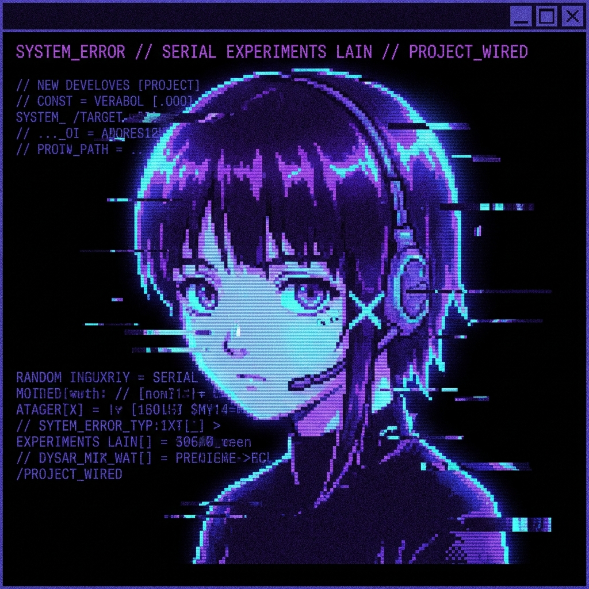

# Fastfetch Configuration

My custom fastfetch configuration with a "Serial Experiments Lain" theme.

## 🖼️ Preview



## 📦 Installation

## 📦 Instalación y Configuración

### 1. Instalar Fastfetch

Lo primero es tener la herramienta instalada en tu sistema.

**macOS (Homebrew):**
```bash
brew install fastfetch
```

**Arch Linux:**
```bash
sudo pacman -S fastfetch
```

### 2. Entendiendo la Configuración

Por defecto, fastfetch busca su configuración en `~/.config/fastfetch/config.jsonc`.

Si quisieras generar la configuración por defecto (solo para ver dónde se guarda y cómo es), podrías ejecutar:
```bash
fastfetch --gen-config
```
*No es necesario hacer esto si vas a usar mi configuración, pero es útil saberlo.*

### 3. Aplicar el Tema (Serial Experiments Lain)

Para usar este tema, necesitamos asegurarnos de que fastfetch lea el archivo `config.jsonc` y encuentre la imagen en `images/lain_fastfetch_icon.png`.

La **forma recomendada** (y como trabajamos en este repositorio) es crear un **Enlace Simbólico**. Esto hace que tu sistema "vea" la configuración directamente desde este repositorio, permitiéndote actualizarla fácilmente.

Ejecuta el siguiente comando para enlazar la carpeta:

```bash
# 1. (Opcional) Respalda tu config actual si tienes una
mv ~/.config/fastfetch ~/.config/fastfetch.bak

# 2. Crea el enlace simbólico a este directorio
ln -s ~/mydotfiles/fastfetch ~/.config/fastfetch
```

Ahora, al ejecutar `fastfetch`, cargará automáticamente el tema con la imagen de Lain.

## 🎨 Características del Tema

- **Imagen**: Pixel art glitcheado de Serial Experiments Lain (generado por IA).
- **Colores**: Paleta ajustada a Cyan y Rojo/Purpura para coincidir con la estética "Wired".
- **Estructura**: Información de Hardware y Software separada en bloques.

## 🎭 Galería de Temas (Script)


Incluido en este directorio encontrarás un script llamado `fastfetch_gallery.sh`.

Este script es una utilidad para **explorar visualmente** todos los "presets" (temas predefinidos) que vienen con fastfetch.

### ¿Qué hace el código?
1.  Carga todos los presets disponibles en memoria.
2.  Muestra una interfaz navegable con el progreso (ej: `Tema 5 de 48`).
3.  Filtra automáticamente tu **IP** (`HIDDEN_IP`) para privacidad.
4.  Permite navegar adelante y atrás.

### Uso
```bash
~/mydotfiles/fastfetch/fastfetch_gallery.sh
```

**Controles:**
- `Enter` / `n` / `➡`: Siguiente tema.
- `p` / `b` / `⬅`: Tema anterior.
- `q`: Salir.

## 📝 Usage

Simply run:

```bash
fastfetch
```

To use a specific config file manually:

```bash
fastfetch --config ~/mydotfiles/fastfetch/config.jsonc
```
