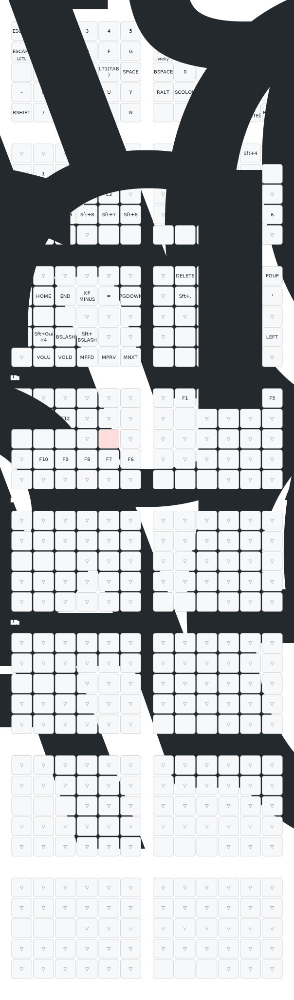

# ⌨️ Silakka54 Dotfiles Configuration

Bienvenido a la configuración de tu teclado **Silakka54** (Split 5x6 Column Staggered).



Esta carpeta contiene todo lo necesario para gestionar el layout del teclado y generar automáticamente la visualización gráfica del mismo.

## 📂 Estructura de Archivos

*   **`silakka54_main.vil`**: El archivo "fuente de la verdad". Es el layout exportado desde **Vial**. Aquí es donde haces tus cambios de teclas.
*   **`render.sh`**: Script maestro de automatización.
    *   Convierte `.vil` -> JSON intermedio.
    *   Invierte las filas de la mano derecha (porque Vial las exporta al revés).
    *   Invoca `post_process.py` para aplicar estilos.
    *   Ejecuta `keymap-drawer` para generar el SVG.
*   **`post_process.py`**: Script en Python que inyecta lógica visual.
    *   Combina los estilos de `draw_config.yaml`.
    *   Asigna automáticamente colores: Rojo para teclas destructivas (`Esc`, `Bksp`) y Azul para capas (`MO`, `LT`).
*   **`qmk_info.json`**: Definición física del teclado. Le dice al dibujante dónde va cada tecla geométricamente (stagger, pulgares).
*   **`draw_config.yaml`**: Configuración visual (CSS, modo oscuro, fuente JetBrains Mono).
*   **`requirements.txt`**: Librerías de Python necesarias (`keymap-drawer`, `PyYAML`).
*   **`keymap.svg`**: La imagen generada automáticamente. **No la edites manualmnete**.

## 🚀 Cómo Funciona la Automatización

Todo está conectado a través de **Git**.

1.  **Edita tu layout**:
    *   Usa [Vial Web](https://vial.rocks/) o Vial Desktop.
    *   Guarda tu configuración como `silakka54_main.vil` en esta carpeta (sobrescribiendo el anterior).
2.  **Haz Commit**:
    *   Simplemente ejecuta `git add .` y `git commit`.
    *   Un **Git Hook** (`.git/hooks/pre-commit`) detectará que cambiaste el `.vil`.
    *   Ejecutará `render.sh` automáticamente.
    *   Si todo sale bien, la imagen `keymap.svg` se actualizará y se añadirá a tu commit.

## 🛠 Instalación y Mantenimiento

Si cambias de ordenador o necesitas reinstalar el entorno:

1.  **Prerrequisitos**: Python 3 instalado.
2.  **Crear entorno virtual**:
    ```bash
    cd mydotfiles/silakka54
    python3 -m venv .venv
    source .venv/bin/activate
    pip install -r requirements.txt
    ```
3.  **Probar generación manual**:
    ```bash
    ./render.sh
    ```

## 🎨 Personalización Visual

Si quieres cambiar colores o estilos:

1.  Edita **`draw_config.yaml`** para cambiar el CSS (colores de fondo, fuentes).
2.  Edita **`post_process.py`** si quieres cambiar qué teclas se consideran "destructivas" (rojas) o de "capa" (azules).

## 🧠 Comportamientos "Mágicos" (Ya configurados)

Tu teclado tiene superpoderes ocultos en la configuración actual:

*   **Hyper Key**: Si mantienes presionado `Enter` (pulgar derecho), actúa como `Cmd+Alt+Ctrl+Shift`. Ideal para atajos de window management (Aerospace).
*   **Escape Rápido**: Presionar `j` + `k` al mismo tiempo = `Esc`. (Combo).
*   **Caps Word**: Presionar `Shift Izquierdo` + `Shift Derecho` al mismo tiempo activa mayúsculas *solo para la palabra actual*. Se desactiva automáticamente al presionar Espacio.
*   **Caps Lock Perenne**: Golpear `Shift Izquierdo` dos veces rápido (Double Tap) = Caps Lock activado permanentemente. (Un toque más para desactivar).
*   **Space**: Configurado como tecla única en el pulgar izquierdo.

---

## 🔮 El Camino hacia Corne (Sugerencias 40%)

Si tu meta es reducir teclas (migrar a un Corne de 42 o 36 teclas) y descartar la fila numérica y columnas exteriores, aquí tienes una hoja de ruta de mejoras sugeridas (sin aplicar aún):

### 1. Home Row Mods (La clave del minimalismo)
Como perderás las columnas exteriores donde viven `Ctrl`, `Alt`, `Shift` clásico, la solución es ponerlos en `A, S, D, F`.
*   Mantener `F` = `Shift`
*   Mantener `D` = `Cmd` (o `Ctrl`)
*   Mantener `S` = `Alt`
*   Esto libera los meñiques y permite teclados en miniatura.

### 2. Capa de Navegación & Mouse (Capa 4 - Vacía)
Podrías usar una de las capas vacías para convertir `I, J, K, L` en un mouse real.
*   Move Mouse Up/Down/Left/Right.
*   Click Izquierdo/Derecho en los pulgares.
*   Scroll con `U` y `O`.
*   *Útil para no soltar el teclado nunca.*

### 3. Capa de Símbolos Optimizada (Coding)
La capa actual tiene símbolos, pero un layout como **"Callum-style mods"** o una capa de símbolos dedicada para programar (`{ } [ ] ( )` en la "Home Row" de una capa) acelera el flujo de código un 200%.

### 4. Capa AeroSpace Dedicada (Capa 5 - Vacía)
Ya que usas AeroSpace, podrías mapear una capa donde:
*   Las teclas `Q, W, E, R...` muevan ventanas directamente sin necesitar el acorde de 4 dedos (Hyper).
*   Simplemente mantienes presionado un pulgar (ej. `Lower`) y presionas `1` para ir al workspace 1.

*Estas son solo ideas para cuando te sientas listo para el siguiente nivel de eficiencia.* 🧪

---
*Documentación generada para el futuro yo.* 🤖
