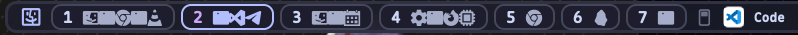
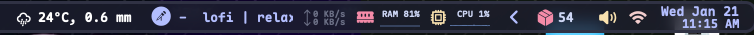

<h1 align="center">
  SketchyBar Configuration (Lua)
</h1>

<p align="center">
  <b>Left Side</b><br>
  
</p>
<p align="center">
  <b>Right Side</b><br>
  
</p>

<p align="center">
  <b>Una configuración moderna, rápida y mantenible escrita en Lua.</b>
</p>

Esta configuración es una evolución completa migrada de Bash a **Lua** (usando SbarLua). Ofrece un rendimiento superior, animaciones más fluidas y una estructura de código más limpia y mantenible.

---

## 🚀 Instalación y Dependencias

Para poder replicar esta configuración en cualquier máquina nueva, sigue estos pasos en orden.

### 1. Prerrequisitos (Homebrew)
Necesitamos instalar el núcleo de Sketchybar y varias utilidades para los widgets (clima, audio, etc.).

```sh
# Agregar los repositorios necesarios (Taps)
brew tap FelixKratz/formulae
brew tap joncrangle/tap

# Instalar Sketchybar y el helper de estadísticas
brew install sketchybar sketchybar-system-stats

# Instalar lenguajes y herramientas
# - lua: Lenguaje de la configuración
# - jq: Procesador JSON (vital para el clima)
# - switchaudio-osx: Cambiar dispositivos de audio
# - media-control: Controlar música (Spotify/Music)
# - imagemagick: Procesamiento de imágenes de iconos
brew install lua jq switchaudio-osx media-control imagemagick
```

### 2. Instalar Fuentes (CRÍTICO)
Sin estas fuentes, verás rectángulos o signos de interrogación en lugar de iconos.

```sh
# Fuentes de iconos y monoespaciadas
brew install --cask font-sketchybar-app-font font-maple-mono-nf-cn
brew install --cask font-hack-nerd-font
```

### 3. Instalar SbarLua (Motor Lua)
Esta configuración **NO** funciona con scripts bash tradicionales. Necesitas compilar e instalar el helper de Lua.

```sh
# Clonar y compilar SbarLua
git clone --depth 1 --quiet https://github.com/FelixKratz/SbarLua.git /tmp/sbarlua
cd /tmp/sbarlua && make install
rm -rf /tmp/sbarlua
```
> **Nota**: Esto instalará `sketchybar.so` en una ruta donde Lua pueda encontrarlo (usualmente `/usr/local/lib/` o `~/.local/share/sketchybar/`).

---

## 📂 Instalación de la Configuración (Dotfiles)

Si ya tienes este repositorio clonado en tu máquina, solo necesitas crear el enlace simbólico.

```sh
# Asegúrate de que no exista una configuración previa
rm -rf ~/.config/sketchybar

# Crea el enlace simbólico (Ajusta la ruta si tus dotfiles están en otro lado)
ln -sf ~/mydotfiles/sketchybar ~/.config/sketchybar

# Reinicia Sketchybar para aplicar cambios
brew services restart sketchybar
```

---

## 📂 Estructura del Proyecto

Esta configuración carga un solo entorno Lua, lo que reduce drásticamente el uso de CPU comparado con scripts bash.

- **`init.lua`**: Punto de entrada. Inicializa la barra y carga los demás archivos.
- **`settings.lua`**: Configuración global (Fuentes, Colores, Márgenes).
- **`items/`**: Definición de cada widget.
  - **`weather/`**: Script híbrido para el clima (`weather.lua` + `weather.sh`).
  - **`monitor/`**: Scripts de sistema (CPU, RAM, Wifi).
  - **`front_app/`**: Muestra la app activa con su icono real.
- **`helpers/`**: Funciones de utilidad y tablas de iconos.

---

## 🌟 Widgets Destacados y Personalizaciones

Hemos realizado varias mejoras clave sobre la configuración base de *Efterklang*:

### 1. Clima (Weather)
- **Híbrido**: Usa un script shell para llamar a `wttr.in` y Lua para renderizar.
- **Requisito**: `jq` debe estar instalado.
- **Personalización**: Muestra iconos dinámicos según el estado del tiempo.

### 2. Monitor de RAM Preciso
- **Mejora**: Usamos un script personalizado (`ram.sh`) que calcula la memoria "Wired + App + Compressed" usando `vm_stat`, dando un % real de uso, mucho más preciso que el comando `memory_pressure`.

### 3. Espacios de Trabajo (Workspaces)
- **Simple**: Usamos números (1, 2, 3...) en lugar de iconos complejos, para alinear visualmente con los atajos de teclado de **AeroSpace**.

---

## 🔧 Troubleshooting (Solución de Problemas)

### "Veo cuadrados en lugar de iconos"
- **Causa**: Falta la fuente `sketchybar-app-font` o las Nerd Fonts.
- **Solución**: Reinstala las fuentes del paso 2 y reinicia la barra (`sketchybar --reload`).

### "El clima no carga o sale vacío"
- **Causa**: Probablemente `jq` no está instalado o no está en el PATH.
- **Verificación**: Ejecuta `which jq`. Si no sale nada, `brew install jq`.
- **API**: Verifica que tienes internet, ya que `wttr.in` requiere conexión.

### "No pasa nada al reiniciar o error de Lua"
- **Causa**: Probablemente **SbarLua** no se instaló bien.
- **Solución**: Repite el paso 3 ("Instalar SbarLua"). Verifica si existe el archivo con `ls /usr/local/lib/sketchybar.so` o `ls ~/.local/share/sketchybar/sketchybar.so`.

### "Espacios con nombres raros"
- Revisa `settings.lua`. Si quieres números, asegúrate de que `ID_STYLE` sea `nil`.
