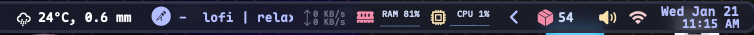

<h1 align="center">
  SketchyBar Configuration (Lua)
</h1>

<p align="center">
  <b>Left Side</b><br>
  
</p>
<p align="center">
  <b>Right Side</b><br>
  
</p>

<p align="center">
  <b>Una configuración moderna, rápida y mantenible escrita en Lua.</b>
</p>

Esta configuración es una evolución completa migrada de Bash a **Lua** (usando SbarLua). Ofrece un rendimiento superior, animaciones más fluidas y una estructura de código más limpia y mantenible.

---

## 🚀 Instalación y Dependencias

Para poder replicar esta configuración en cualquier máquina nueva, sigue estos pasos en orden.

### 1. Prerrequisitos (Homebrew)
Necesitamos instalar el núcleo de Sketchybar y varias utilidades para los widgets (clima, audio, etc.).

```sh
# Agregar los repositorios necesarios (Taps)
brew tap FelixKratz/formulae
brew tap joncrangle/tap

# Instalar Sketchybar y el helper de estadísticas
brew install sketchybar sketchybar-system-stats

# Instalar lenguajes y herramientas
# - lua: Lenguaje de la configuración
# - jq: Procesador JSON (vital para el clima)
# - switchaudio-osx: Cambiar dispositivos de audio
# - media-control: Controlar música (Spotify/Music)
# - imagemagick: Procesamiento de imágenes de iconos
brew install lua jq switchaudio-osx media-control imagemagick
```

### 2. Instalar Fuentes (CRÍTICO)
Sin estas fuentes, verás rectángulos o signos de interrogación en lugar de iconos.

```sh
# Fuentes de iconos y monoespaciadas
brew install --cask font-sketchybar-app-font font-maple-mono-nf-cn
brew install --cask font-hack-nerd-font
```

### 3. Instalar SbarLua (Motor Lua)
Esta configuración **NO** funciona con scripts bash tradicionales. Necesitas compilar e instalar el helper de Lua.

```sh
# Clonar y compilar SbarLua
git clone --depth 1 --quiet https://github.com/FelixKratz/SbarLua.git /tmp/sbarlua
cd /tmp/sbarlua && make install
rm -rf /tmp/sbarlua
```
> **Nota**: Esto instalará `sketchybar.so` en una ruta donde Lua pueda encontrarlo (usualmente `/usr/local/lib/` o `~/.local/share/sketchybar/`).

---

## 📂 Instalación de la Configuración (Dotfiles)

Si ya tienes este repositorio clonado en tu máquina, solo necesitas crear el enlace simbólico.

```sh
# Asegúrate de que no exista una configuración previa
rm -rf ~/.config/sketchybar

# Crea el enlace simbólico (Ajusta la ruta si tus dotfiles están en otro lado)
ln -sf ~/mydotfiles/sketchybar ~/.config/sketchybar

# Reinicia Sketchybar para aplicar cambios
brew services restart sketchybar
```

---

## 📂 Estructura del Proyecto

Esta configuración carga un solo entorno Lua, lo que reduce drásticamente el uso de CPU comparado con scripts bash.

- **`init.lua`**: Punto de entrada. Inicializa la barra y carga los demás archivos.
- **`settings.lua`**: Configuración global (Fuentes, Colores, Márgenes, `WINDOW_MANAGER`).
- **`items/`**: Definición de cada widget.
  - **`spaces/window_managers/aerospace.lua`**: Módulo de integración con AeroSpace (workspaces + indicador de modo).
  - **`spaces/window_managers/macos_native.lua`**: Módulo para Spaces nativos de macOS (no activo).
  - **`weather/`**: Script híbrido para el clima (`weather.lua` + `weather.sh`).
  - **`monitor/`**: Scripts de sistema (CPU, RAM, Wifi).
  - **`front_app/`**: Muestra la app activa con su icono real.
- **`helpers/`**: Funciones de utilidad y tablas de iconos.

---

## 🌟 Widgets Destacados y Personalizaciones

Hemos realizado varias mejoras clave sobre la configuración base de *Efterklang*:

### 1. Clima (Weather)
- **Híbrido**: Usa un script shell para llamar a `wttr.in` y Lua para renderizar.
- **Requisito**: `jq` debe estar instalado.
- **Personalización**: Muestra iconos dinámicos según el estado del tiempo.

### 2. Monitor de RAM Preciso
- **Mejora**: Usamos un script personalizado (`ram.sh`) que calcula la memoria "Wired + App + Compressed" usando `vm_stat`, dando un % real de uso, mucho más preciso que el comando `memory_pressure`.

### 3. Integración con AeroSpace (Window Manager)

Sketchybar reemplaza los Spaces nativos de macOS mostrando los workspaces de AeroSpace.

- **Configuración**: En `settings.lua`, `WINDOW_MANAGER = "aerospace"` activa el módulo correspondiente.
- **Módulo**: `items/spaces/window_managers/aerospace.lua` crea los ítems de workspace.

#### Decisiones técnicas importantes

| Problema | Solución |
|---|---|
| `SBAR.add("space", ...)` solo acepta IDs enteros (Spaces de macOS) | Se usa `SBAR.add("item", ...)` que acepta strings como `"U"`, `"I"`, `"O"` |
| Los eventos Lua (`subscribe`) no reaccionaban bien para controlar el ítem de modo o el highlight del workspace | Se eliminaron los subscribers Lua; AeroSpace controla los ítems directamente vía CLI (`sketchybar --set`) usando scripts externos (Ver [SCRIPTS.md](../aerospace/SCRIPTS.md)) |
| `exec-and-forget` de AeroSpace no encontraba el binario `sketchybar` | Se usa la ruta absoluta `/usr/local/bin/sketchybar` (ver nota en el [README de AeroSpace](../aerospace/README.md#-nota-técnica-importante-path-en-exec-and-forget)) |
| `sketchybar --reload` no siempre recarga los módulos Lua | Se usa `brew services restart sketchybar` para un reinicio completo |
| Los workspaces no aparecen al reiniciar (los ítems `space.*` no se crean) | Sketchybar arranca sin el PATH del shell; `io.popen("aerospace ...")"` falla silenciosamente. Solución: ruta absoluta `"/usr/local/bin/aerospace"` en [`aerospace.lua`](items/spaces/window_managers/aerospace.lua). Ver [TROUBLESHOOTING.md](TROUBLESHOOTING.md) |
| AeroSpace no estaba listo al arrancar (race condition) — los workspaces aparecen vacíos | Auto-retry timer en `aerospace.lua`: consulta AeroSpace cada 3s (máx 10 intentos). Cuando responde, espera 1s y ejecuta `sketchybar --reload`. Cero overhead si AeroSpace ya estaba listo. Ver [TROUBLESHOOTING.md](TROUBLESHOOTING.md#manejo-de-workspaces-vacíos-al-arrancar-race-condition) |

#### Componentes

1. **Workspaces (U, I, O, P, Y, N)**: Ítems a la izquierda de la barra que muestran cada workspace con su letra e íconos de las apps que contiene. El workspace activo se resalta en color lavanda.
2. **Indicador de modo (`aerospace_mode`)**: Ítem oculto por defecto (`drawing = false`). AeroSpace lo muestra/oculta directamente con `--set drawing=on/off` desde `aerospace.toml` al entrar/salir de modos (ej: servicio). Muestra `[S]` en rojo para el modo servicio.

---

## 🔧 Troubleshooting (Solución de Problemas)

### "Veo cuadrados en lugar de iconos"
- **Causa**: Falta la fuente `sketchybar-app-font` o las Nerd Fonts.
- **Solución**: Reinstala las fuentes del paso 2 y reinicia la barra (`sketchybar --reload`).

### "El clima no carga o sale vacío"
- **Causa**: Probablemente `jq` no está instalado o no está en el PATH.
- **Verificación**: Ejecuta `which jq`. Si no sale nada, `brew install jq`.
- **API**: Verifica que tienes internet, ya que `wttr.in` requiere conexión.

### "No pasa nada al reiniciar o error de Lua"
- **Causa**: Probablemente **SbarLua** no se instaló bien.
- **Solución**: Repite el paso 3 ("Instalar SbarLua"). Verifica si existe el archivo con `ls /usr/local/lib/sketchybar.so` o `ls ~/.local/share/sketchybar/sketchybar.so`.

### "Espacios con nombres raros"
- Revisa `settings.lua`. Si quieres números, asegúrate de que `ID_STYLE` sea `nil`.

### "No veo los workspaces de AeroSpace / solo veo un Space"
- Verifica que `WINDOW_MANAGER = "aerospace"` en `settings.lua`.
- Ejecuta `brew services restart sketchybar` (un `--reload` no siempre recarga los módulos Lua).
- Verifica que AeroSpace está corriendo: `aerospace list-workspaces --all`.

### "Los workspaces no aparecen después de reiniciar el sistema"
- **Causa conocida**: Sketchybar arranca sin el PATH del shell; el binario `aerospace` no se encuentra desde Lua. O bien ocurre una "race condition" durante el arranque de macOS.
- **Estado de Pruebas**: Se implementó una solución (auto-retry timer) que funcionó con éxito en el arranque actual, logrando que AeroSpace cargue y al final Sketchybar se actualice con la información correcta de los workspaces. **IMPORTANTE:** Se debe probar este comportamiento durante N arranques para confirmar que siempre sea funcional de manera consistente y no dependa de otros factores aleatorios del arranque.
- **Verificación**: `sketchybar --query space.U` → si devuelve `not found`, el bug está activo.
- **Implementación principal**: ruta absoluta en [`aerospace.lua`](items/spaces/window_managers/aerospace.lua) y auto-retry timer.
- **Detalle completo**: [TROUBLESHOOTING.md](TROUBLESHOOTING.md).

### "El indicador de modo [S] no aparece al entrar a modo servicio"
- Verifica que `aerospace.toml` usa la ruta absoluta: `/usr/local/bin/sketchybar --set aerospace_mode drawing=on`.
- Si cambiaste la ubicación de Sketchybar, actualizá la ruta con `which sketchybar`.

### ⛔ "Se congeló la máquina después de modificar aerospace.toml"
- **Causa**: Se usó `after-startup-command` con `sketchybar --reload`, creando un loop de reload exponencial.
- **NUNCA hacer esto** — ver [TROUBLESHOOTING.md — Sección PELIGRO](TROUBLESHOOTING.md#-peligro-lo-que-nunca-hay-que-hacer).
- **Recovery**: Mantener el botón de encendido ~10s para apagar. Revertir con `git checkout -- aerospace/aerospace.toml`.

