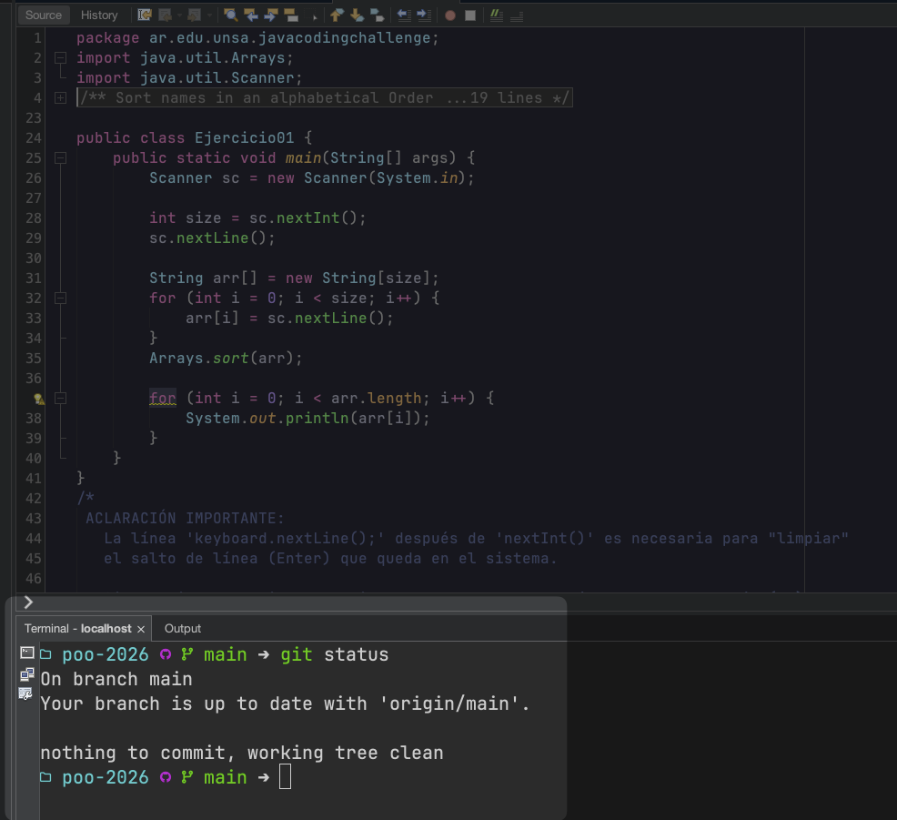

# Zsh Configurations & Fixes

Esta carpeta contiene scripts y configuraciones modulares respaldadas para la terminal Zsh.

## netbeans_fix.zsh

Este script soluciona los problemas visuales al usar la terminal integrada del antiguo IDE de Java **Apache NetBeans**, salvaguardando al mismo tiempo la experiencia premium en el resto de tu computadora.

**¿Qué hace y por qué existe?**
La consola heredada de NetBeans no es capaz de procesar la paleta de colores "TrueColor" (RGB 24 bits) de manera nativa. Esto provoca que emuladores avanzados de carga ultrarrápida como **Starship** impriman errores o "basura visual" cruda en la pantalla (como `161m`).

El código de este fix realiza tres pasos fundamentales de manera silenciosa:
1. Inspecciona las variables de entorno del sistema operativo y detecta si la terminal solicitando abrir fue instanciada desde NetBeans.
2. Desactiva la inicialización global de Starship **exclusivamente** para esa instancia de NetBeans. El resto de aplicaciones (VS Code, iTerm, Terminal nativa) correrán Starship normalmente a toda velocidad.
3. Inyecta y elabora "a mano" un prompt auxiliar inteligente forzando colores básicos de 8 bits (totalmente asimilables por NetBeans) y renderizando elegantemente los íconos limpios de Nerd Fonts (`` y ``), condicionados matemáticamente para que aparezcan **únicamente** si el sistema detecta que la carpeta activa es un repositorio Git válido.

### 🚀 ¿Cómo aplicarlo en otra computadora?
Para recrear la misma experiencia fluida en un entorno o Mac nuevo, solo necesitas:
1. Copiar el bloque de código íntegro del archivo `netbeans_fix.zsh`.
2. Pegarlo en tu archivo oculto maestro de Zsh (`~/.zshrc`), asegurándote de reemplazar con este código la línea por defecto donde inicializas tu emulador, es decir, el típico `eval "$(starship init zsh)"`.

### ⚠️ Requisitos
Asegúrate de configurar globalmente dentro de NetBeans (en `Tools -> Options -> Appearance -> Colors & Fonts`) la misma tipografía monoespaciada oficial de tu sistema, como **Maple Mono NF CN** (o cualquier Nerd Font instalada), para evitar que los logotipos de la rama y GitHub se transformen en cuadrados rotos por falta de glifos.

### 🖼️ Resultado Visual

